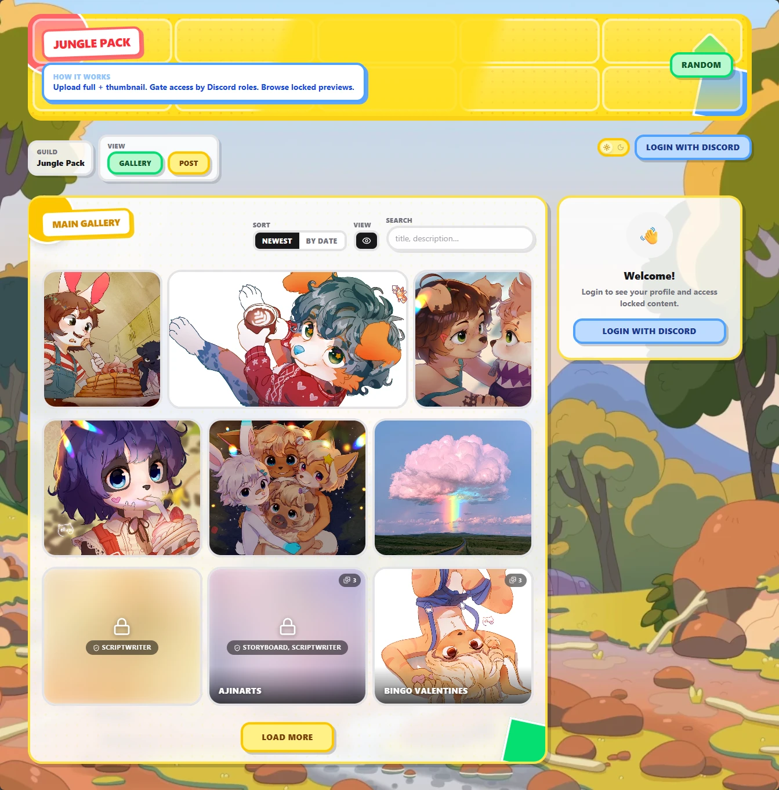
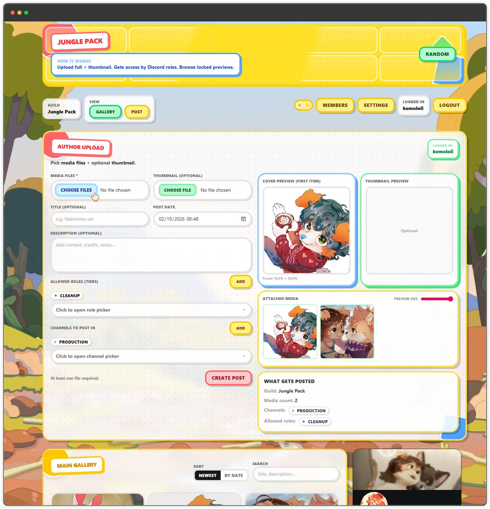

# Aegis

## Summary

Aegis is a versatile content-sharing platform for creators and private communities that starts with a modern frontend gallery for browsing, uploading, and managing media, then connects that experience directly to Discord for role-gated delivery. Built in Go with `discordgo`, backed by lightweight SQLite persistence, and optionally integrated with Amazon S3 for fallback storage, Aegis is designed to stay simple to run while remaining flexible through environment-variable and flag-based configuration. It combines:

- A Discord bot for posting and role-gated access
- A web gallery for browsing, uploading, and managing posts
- A lightweight SQLite database (with optional S3 fallback storage)

The goal is simple: share media with the right people, in Discord and on the web, without managing a complex stack.

> [!NOTE]
> Aegis runs as one Go service that starts both the Discord bot and the web app backend.

## Frontend (Web Gallery)

The frontend is a React + Vite app embedded into the Go server for production builds.

- Browse posts in gallery or detail view
- Upload and edit posts from the author panel (admin-gated)
- Use role/channel-aware metadata when creating posts
- Login with Discord OAuth and continue with JWT-based sessions




> [!TIP]
> The image links above are placeholders so you can drop your own images into `docs/homepage.webp` and `docs/upload_panel.webp`.

## What changed

Recent updates on the app branch focused on the web experience and media flow:

- Improved post/media model (multiple files per post)
- Better role/channel name caching and AllowedRoles handling
- Thumbnail and gallery rendering improvements
- Post listing cache invalidation on write operations
- Enhanced post detail UX (carousel, fullscreen, swipe behavior)
- Better release/build workflow updates for app + backend

## Discord bot usage (pkg/drigo)

The original bot posting flow is still available through the slash command in `pkg/drigo`:

- `/post`

Command options:

- `full` (required): full-resolution attachment
- `thumbnail` (optional): preview image shown in-channel
- `title` (optional): post title
- `description` (optional): post description
- `allowed_roles` (optional): one role directly, or leave empty to select multiple in modal
- `allowed_channels` (optional): one channel directly, or leave empty to select multiple in modal

When `allowed_roles`/`allowed_channels` are not fully provided, Aegis opens a modal so you can choose multiple roles/channels before publishing.

> [!TIP]
> The `/post` command supports posting into multiple channels in one action when selected in the modal.

## Quick start

### 1) Configure environment

Create a `.env` file in the project root:

```env
# Required
BOT_TOKEN="YOUR_BOT_TOKEN"

# Required for Discord OAuth login in the web app
CLIENT_ID="YOUR_DISCORD_APP_CLIENT_ID"
CLIENT_SECRET="YOUR_DISCORD_APP_CLIENT_SECRET"

# Strongly recommended for production (JWT signing)
JWT_SECRET="CHANGE_ME_TO_A_LONG_RANDOM_SECRET"

# Optional
GUILD_ID="YOUR_GUILD_ID"
PORT="3000"
REMOVE_COMMANDS="false"

# Optional S3 fallback uploads
ACCESS_KEY=""
SECRET_KEY=""
S3_BUCKET=""
S3_REGION="us-east-1"
S3_ENDPOINT=""
S3_PREFIX=""
```

> [!IMPORTANT]
> `BOT_TOKEN` is required or the app exits at startup.

> [!WARNING]
> `REMOVE_COMMANDS=true` removes slash commands when the bot shuts down.

> [!CAUTION]
> If `JWT_SECRET` is not set, Aegis uses a default secret (`secret`), which is unsafe for public deployments.

## Discord OAuth configuration guide

Create (or open) your application in the Discord Developer Portal and configure:

- **OAuth2 Redirect URL**: `https://YOUR_DOMAIN/auth/callback`
- **Scopes**: `identify`, `guilds`
- **Environment values**:
	- `CLIENT_ID` = application client ID
	- `CLIENT_SECRET` = application client secret

For local development, the callback must match your local host/port, for example:

- `http://localhost:4173/auth/callback` (frontend-dev proxy flow)
- `http://localhost:3000/auth/callback` (single-server local run)

> [!IMPORTANT]
> Redirect URLs are exact-match in Discord. If scheme, host, port, or path differs, login fails.

## Bot configuration guide

### Discord application and bot

- Create a Discord application and add a bot user
- Copy bot token into `BOT_TOKEN`
- Invite the bot to your server with application command permissions
- Set `GUILD_ID` if you want guild-scoped behavior (optional)

### Runtime behavior

- `REMOVE_COMMANDS=false` is recommended for normal operation
- Set `JWT_SECRET` to a long random value before public deployment
- Optional S3 values enable large-upload fallback storage

> [!WARNING]
> Rotating `JWT_SECRET` invalidates existing login sessions.

### 2) Run backend + bot

```bash
CGO_ENABLED=0 go run ./cmd
```

### 3) Frontend development (optional)

In a separate shell:

```bash
cd app
bun install
bun run dev
```

The Vite dev server proxies API requests to the Go backend on `http://localhost:4173`.

> [!IMPORTANT]
> For local frontend development, run the backend with `PORT=4173` so proxy routes resolve correctly.

## Docker quick start

Use Docker when you want a packaged run of frontend + backend in one container.

### 1) Prepare environment

Set required values in your root `.env` (at minimum `BOT_TOKEN`, `CLIENT_ID`, `CLIENT_SECRET`, `JWT_SECRET`).

### 2) Build and start

```bash
docker compose up --build -d
```

### 3) View logs / stop

```bash
docker compose logs -f app
docker compose down
```

The compose setup maps:

- App port: `${PORT:-3000}`
- Database file: `./sqlite.db` -> `/app/sqlite.db`

> [!NOTE]
> The Docker build compiles the frontend first, embeds `app/dist`, then builds the Go binary.

## Environment variables from os.Getenv

This list is generated from current `os.Getenv(...)` usage in the codebase.

### Runtime variables

| Variable          | Required      | Purpose                                               |
|-------------------|---------------|-------------------------------------------------------|
| `BOT_TOKEN`       | Yes           | Discord bot token used to start the bot session       |
| `CLIENT_ID`       | For web login | Discord OAuth2 client ID used in `/auth/callback`     |
| `CLIENT_SECRET`   | For web login | Discord OAuth2 client secret used in `/auth/callback` |
| `JWT_SECRET`      | Recommended   | Secret used to sign JWT session tokens                |
| `GUILD_ID`        | Optional      | Guild/server scope for bot operations                 |
| `PORT`            | Optional      | HTTP server port (defaults to `3000`)                 |
| `REMOVE_COMMANDS` | Optional      | If `true`, removes slash commands on shutdown         |
| `ACCESS_KEY`      | Optional*     | S3 access key                                         |
| `SECRET_KEY`      | Optional*     | S3 secret key                                         |
| `S3_BUCKET`       | Optional*     | S3 bucket name                                        |
| `S3_REGION`       | Optional      | S3 region (`us-east-1` default when S3 is enabled)    |
| `S3_ENDPOINT`     | Optional      | Custom S3 endpoint                                    |
| `S3_PREFIX`       | Optional      | Object key prefix for uploads                         |

\*S3 upload fallback is enabled only when `ACCESS_KEY`, `SECRET_KEY`, and `S3_BUCKET` are all set.

### Other env reads in repository

- `PATH` is read internally when setting up static ffmpeg shims (`ffstatic` build).
- `DG*` / `DGB_TOKEN` / `DGU_TOKEN` env vars are used by `src/discordgo` tests, not by normal Aegis runtime.

## End-user flow

- Admin creates or edits media posts
- Post can be restricted by Discord roles/channels
- Members view allowed content in Discord or the web gallery
- Members can open full media and send content to DMs when permitted

> [!NOTE]
> The first successfully logged-in web user is auto-promoted to admin for initial setup.

## Quick checklist

- [ ] Set `BOT_TOKEN`, `CLIENT_ID`, `CLIENT_SECRET`, and `JWT_SECRET`
- [ ] Run `CGO_ENABLED=0 go run ./cmd`
- [ ] Open the web app and complete Discord login
- [ ] Test an admin upload and a role-restricted view
